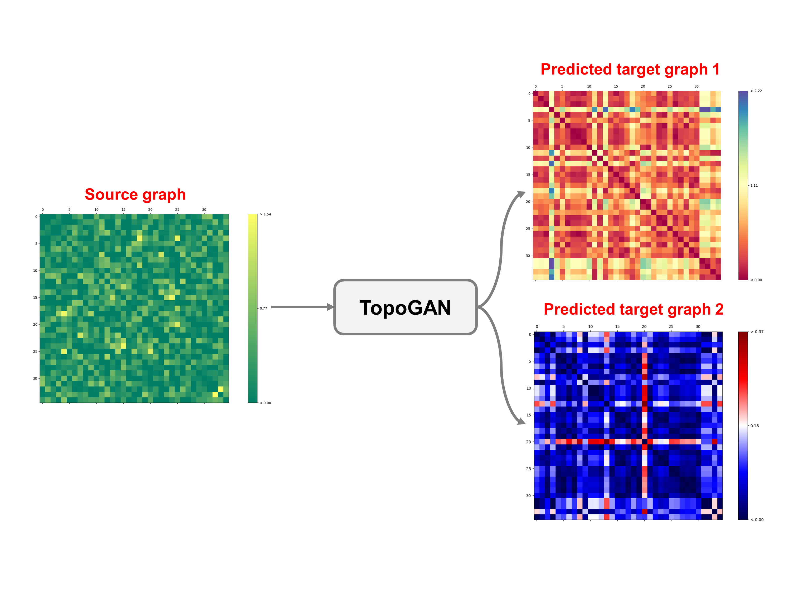

# topoGAN
A geometric deep learning framework for jointly predicting multiple brain graphs from a single brain graph, coded up in Python by Alaa Bessadok. Please contact alaa.bessadok@gmail.Com for further inquiries. Thanks. 

This repository provides the official PyTorch implementation of the following paper:

<p align="center">
  
</p>


> **Brain Multigraph Prediction using Topology-Aware Adversarial Graph Neural Network**
> [Alaa Bessadok](https://github.com/AlaaBessadok)<sup>1,2</sup>, [Mohamed Ali Mahjoub]<sup>2</sup>, [Islem Rekik](https://basira-lab.com/)<sup>1</sup>
> <sup>1</sup>BASIRA Lab, Faculty of Computer and Informatics, Istanbul Technical University, Istanbul, Turkey
> <sup>2</sup>University of Sousse, Higher Institute of Informatics and Communication Technologies, Sousse, Tunisia
>
> **Abstract:** *Brain graphs (i.e, connectomes) constructed from medical scans such as magnetic resonance imaging (MRI) have become increasingly important tools to characterize the abnormal changes in the human brain. Due to the high acquisition cost and processing time of multimodal MRI, existing deep learning frameworks based on Generative Adversarial Network (GAN) focused on predicting the missing multimodal medical images from a few existing modalities. While brain graphs help better understand how a particular disorder can change the connectional facets of the brain, synthesizing a target brain \emph{multigraph} (i.e, multiple brain graphs) from a single source brain graph is strikingly lacking. Additionally, existing graph generation works mainly learn one model for each target domain which limits their scalability in \emph{jointly} predicting multiple target domains. Besides, while they consider the global topological scale of a graph (i.e., graph connectivity structure), they overlook the local topology at the node scale (e.g., how central a node is in the graph). To address these limitations, we introduce topology-aware graph GAN architecture (topoGAN), which {jointly} predicts multiple brain graphs from a single brain graph while preserving the topological structure of each target graph. Its three key innovations are: (i) designing a novel graph adversarial auto-encoder for predicting multiple brain graphs from a single one, (ii) clustering the encoded source graphs in order to handle the mode collapse issue of GAN and proposing a \emph{cluster-specific decoder}, (iii) introducing a \emph{topological loss} to force the prediction of topologically sound target brain graphs. The experimental results using five target domains demonstrated the outperformance of our method in brain multigraph prediction from a single graph in comparison with baseline approaches.*

This work is published in Medical Image Analysis Journal 2021. topoGAN is a geometric deep learning framework for jointly predicting multiple brain graphs from a single graph in an end-to-end learning fashion. It comprises three key steps (1) source graphs embedding and clustering, (2) cluster-specific multi-target graph prediction and, (3) topology-aware regularization for preserving topological graph structure of the target graphs. We have evaluated our method on morphological brain graphs from ABIDE dataset. Detailed information can be found in the original paper. Here, we release the code for training and testing topoGAN on a simulated dataset.

# Installation

The code has been tested on a computer having Ubuntu 16.04 and GPU is needed to speed up the execution of the code. You also need to install dependencies:

* [Python >= 3](https://www.python.org)
* [PyTorch 1.3.1](https://pytorch.org/)
* [Numpy >= 1.8](https://numpy.org/)
* [networkx >= 0.17](https://networkx.org/documentation/stable/install.html)
* [SIMLR](https://github.com/bowang87/SIMLR_PY)


# Training and testing

We provide a demo code for the usage of topoGAN for multiple target graphs prediction from a source graph. In main.py we train the model on a simulated dataset with 280 subjects and test it on 30 subjects. Each sample has 6 brain graphs (one source graph and five target graphs). In this example, we used three input arguments (i.e., num_domains, nb_clusters and mode), you can add hyper-parameters (e.g., lambda_topology, lambda_rec) and vary their default values. To train the model you nedd to add to the following command "--mode='train' and if you want to test it you need to add "--mode='test'"  

```bash
python main.py --num_domains=6 --nb_clusters=2 
```

# Input and output data

In order to use our framework, you need to provide a source_target_domains list where each element is a matrix of size (n * f). We denote n the total number of subjects in the dataset and f the number of features. Any element of the list can be considered as the source domain and the rest are the target domains. You need to include your data in the file main.py. So, just remove our simulated training and testing dataset and replace it with yours. If you set the number of source and target domains to 3 using this argument --num_domains=3 , and keep the same size of our simulated data, the execution of main.py will produce saved csv files of the source and target data. Then, you can plot the brain graphs of any subject from the saved csv files. To do so, run the plot.py to get the following outputs:

<p align="center">
  
</p>

# Related references

Multi-Marginal Wasserstein GAN (MWGAN): 
Cao, J., Mo, L., Zhang, Y., Jia, K., Shen, C., Tan, M.: Multi-marginal wasserstein gan. [https://arxiv.org/pdf/1911.00888.pdf] (2019) [https://github.com/caojiezhang/MWGAN].

Single‐cell Interpretation via Multi‐kernel LeaRning (SIMLR):
Wang, B., Ramazzotti, D., De Sano, L., Zhu, J., Pierson, E., Batzoglou, S.: SIMLR: a tool for large-scale single-cell analysis by multi-kernel learning. [https://www.biorxiv.org/content/10.1101/052225v3] (2017) [https://github.com/bowang87/SIMLR_PY].


# Citation

If our code is useful for your work please cite our paper:

```latex
@inproceedings{bessadok2020,
title={Brain Multigraph Prediction using Topology-Aware Adversarial Graph Neural Network},
author={Bessadok, Alaa and Mahjoub, Mohamed Ali and Rekik, Islem},
booktitle={Medical Image Analysis},
year={2021},
organization={Springer}
}
```

# Acknowledgement

This project has been funded by the 2232 International Fellowship for Outstanding Researchers Program of TUBITAK (Project No:118C288, http://basira-lab.com/reprime/) supporting Dr. Islem Rekik. However, all scientific contributions made in this project are owned and approved solely by the authors.

# License
Our code is released under MIT License (see LICENSE file for details).


